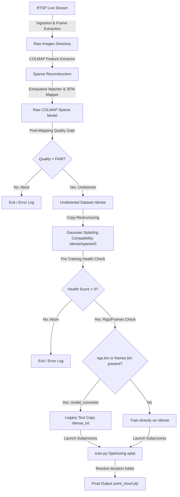

# Vizhi Spatial Studio

Vizhi Spatial Studio is a professional, workstation-grade real-time RTSP stream capture, COLMAP sparse/dense reconstruction, and 3D Gaussian Splatting platform designed for Windows platforms with NVIDIA CUDA hardware acceleration.

It features a high-fidelity cinematic UI (modeled after Unreal Engine 5 and DaVinci Resolve) with built-in camera undistortion, newer COLMAP compatibility conversion layers, detailed pre-flight diagnostic checklists, and dynamic dataset health scoring.

---

## Architecture & Pipeline Flow



---

## 🛠️ Prerequisites & Required Tools

To run Vizhi Spatial Studio, your system must have an **NVIDIA GPU** with CUDA support.

### 1. Python Environment Manager
Install [Miniconda](https://docs.conda.io/en/latest/miniconda.html) or [Anaconda](https://www.anaconda.com/) (Python 3.9+).

### 2. Required Binaries & Tools
The workstation expects your tools folder to be laid out as follows:
```
D:\vizhi-spatial-software\
 ├─ tools\
 │   ├─ colmap-x64-windows-cuda\         # COLMAP with CUDA enabled (must contain COLMAP.bat)
 │   ├─ gaussian-splatting\              # 3D Gaussian Splatting codebase (must contain train.py)
 │   └─ mediamtx\                        # MediaMTX RTSP Server executable and config
 ├─ datasets\                            # Datasets, logs, and outputs directory (auto-managed)
 └─ vizhi-spatial-studio\                # This repository
```

* **COLMAP (CUDA-Enabled)**: Download the Windows CUDA version from the official [COLMAP Releases](https://github.com/colmap/colmap/releases) and extract it.
* **3D Gaussian Splatting**: Clone the [Gaussian Splatting Windows Fork](https://github.com/graphdeco-inria/gaussian-splatting) or equivalent repository.
* **MediaMTX**: Download the Windows executable from [MediaMTX Releases](https://github.com/bluenviron/mediamtx/releases) to route and serve RTSP video streams.

---

## 📦 Environment Setup Guide

Follow these steps to create your environment and install all dependencies:

### 1. Create and Activate the Conda Environment
Open Anaconda Prompt (or terminal) and execute:
```powershell
# Create environment with Python 3.9
conda create -n vizhi-studio python=3.9 -y

# Activate the environment
conda activate vizhi-studio
```

### 2. Install PyTorch with CUDA Acceleration
Install the correct PyTorch package matching your CUDA Toolkit version. For example, for CUDA 11.8:
```powershell
pip install torch torchvision torchaudio --index-url https://download.pytorch.org/whl/cu118
```
*(For CUDA 12.1, replace `cu118` with `cu121`)*

### 3. Install GUI and Image Processing Packages
Install the required windowing, configuration, and image manipulation modules:
```powershell
# PyQt6 GUI framework
pip install PyQt6

# OpenCV (for real-time RTSP parsing and video frame draining)
pip install opencv-python

# YAML parsing (for MediaMTX configuration)
pip install pyyaml

# 3D file and math packages
pip install numpy pillow plyfile tqdm
```

---

## 🚀 How to Run

### 1. Run the Studio Workspace
Ensure your Conda environment is active, navigate to the code directory, and run `main.py`:
```powershell
conda activate vizhi-studio
cd D:\vizhi-spatial-software\vizhi-spatial-studio
python main.py
```

### 2. Run on Other Devices / Configure Paths
If you need to change the default directories or execute on another drive:
- Edit the path variables inside `core/project_manager.py`:
  - `RECENT_FILE`: Location of the recent projects registry.
  - `DATASETS_DIR`: Folder where capturing, mapping, and splats are stored.
- Edit binaries paths in `workers/colmap_worker.py` and `workers/gaussian_worker.py`:
  - `colmap_dir`: Set to your local CUDA-enabled COLMAP folder.
  - `gs_dir`: Set to your local Gaussian Splatting toolkit directory.
  - `python_exe`: Set to your local activated Conda environment python executable.

---

## 📊 Pipeline Quality Gates & Validations

### 1. Post-Mapping Quality Gate (COLMAP Worker)
Directly after mapper triangulation completes, the quality is classified as:
* **POOR**: Registered Images < 20 or Sparse Points < 3,000. (Aborts early to prevent GPU cycles wastage)
* **FAIR**: Images < 50 or Points < 10,000. (Logs warnings but continues)
* **GOOD** / **EXCELLENT**: Normal execution.
Saves metrics locally to `<project>/logs/reconstruction_report.json`.

### 2. Pre-Training Health score Check (Gaussian Worker)
Calculates dataset health out of 100 before committing to splat training:
```
[GAUSSIAN] Dataset Health Check
[GAUSSIAN] Images Found ............ PASS
[GAUSSIAN] Sparse Model ............ PASS
[GAUSSIAN] Camera Model ............ PASS (Detected: SIMPLE_PINHOLE)
[GAUSSIAN] Registered Images ....... 77
[GAUSSIAN] Sparse Points ........... 3906
[GAUSSIAN] 
[GAUSSIAN] Health Score: 61/100
[GAUSSIAN] Status: READY FOR TRAINING
```

### 3. Converted TXT Compatibility Layer
If the reconstruction outputs contain newer metadata like `rigs.bin` or `frames.bin` which crash legacy loader scripts:
- It converts the model to text format (`TXT`) to `<project>/dense_txt/sparse/0`.
- Routes training commands using `-s <project>/dense_txt` and `--images <project>/dense/images`.
- Keeps your original binary `.bin` files completely untouched.
